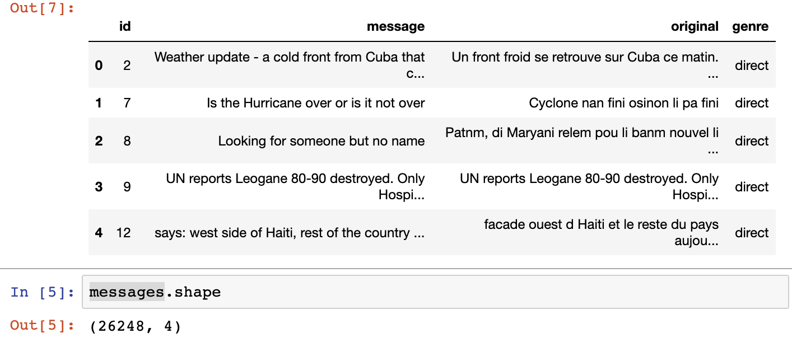
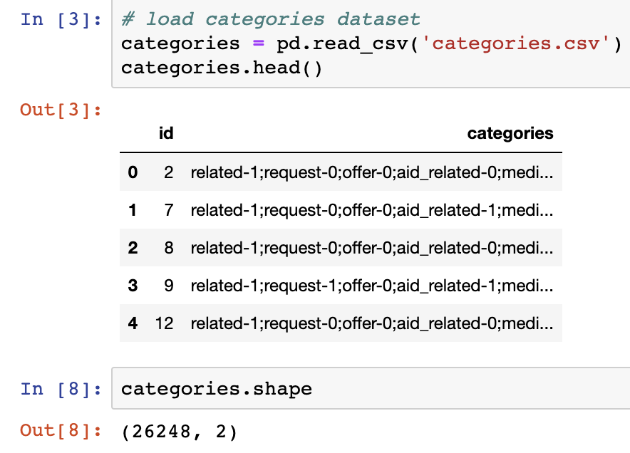
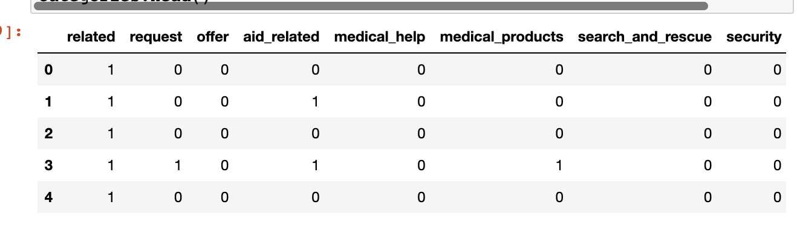
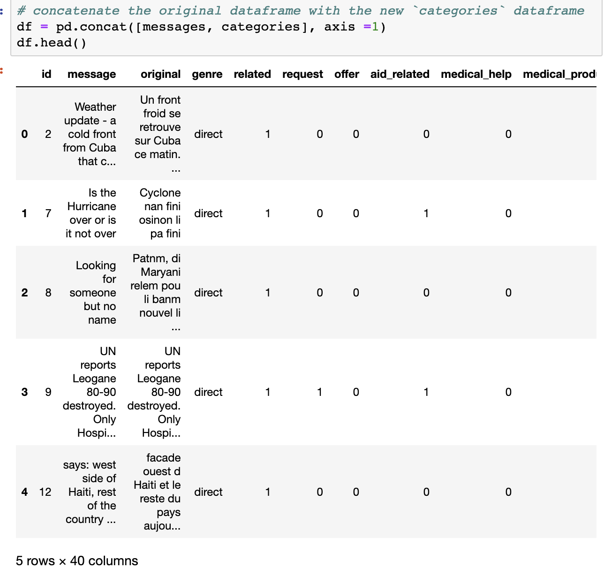
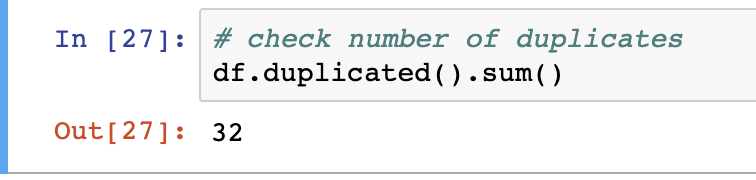
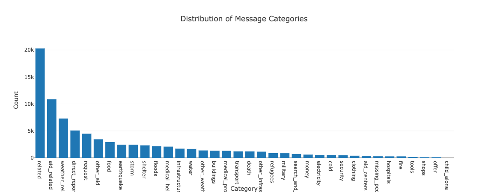
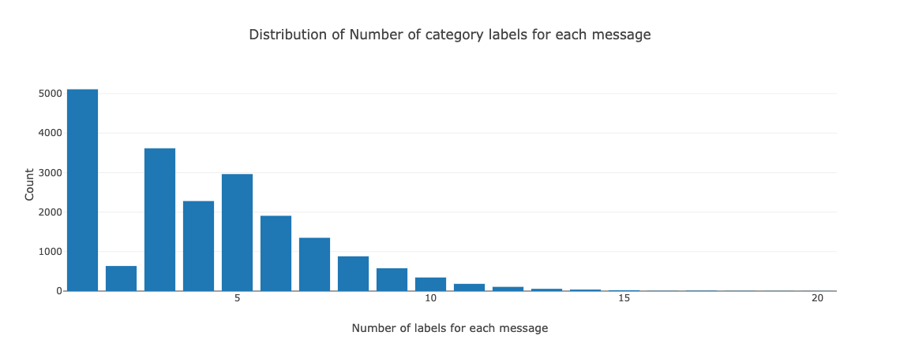
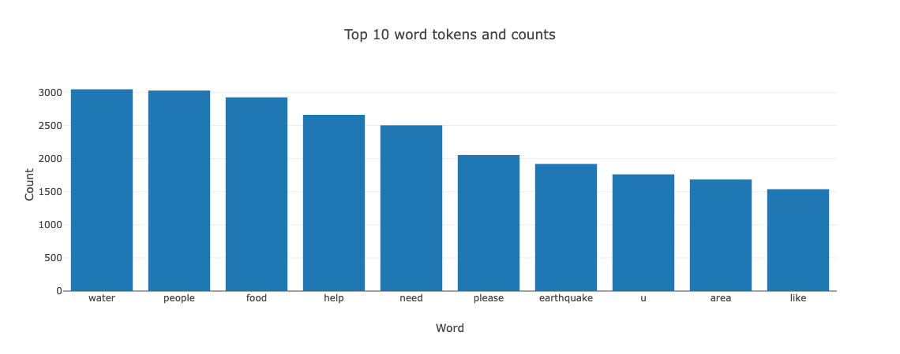
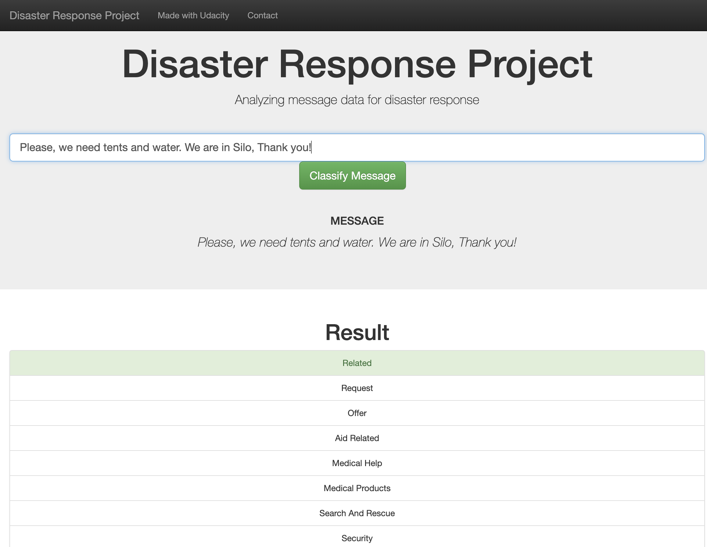

# Disaster Response Pipeline Project

## About the project
This project takes around 26k+ disaster report messages from different sources as source data, clean and train a classification model with the data,  which aims to build a model that categories incoming message into its most related categories, it can help disaster response organizations to quickly identify the disaster type and provide aid accordingly and faster, as manual labeling can be error-prone and cumbersome. It is built as a Flask app.

## Instructions to run the app locally
1. Run the following commands in the project's root directory to set up your database and model.

    - To run ETL pipeline that cleans data and stores in database
        `python data/process_data.py data/disaster_messages.csv data/disaster_categories.csv data/DisasterResponse.db`
    - To run ML pipeline that trains classifier and saves
        `python models/train_classifier.py data/DisasterResponse.db models/classifier.pkl`

2. Run the following command in the app's directory to run your web app.
    `python run.py`

3. Go to http://0.0.0.0:3001/

## File structure and purpose of each components
```
- app
| - template
| |- master.html  # main page of web app, including some statistical data visualization 
| |- go.html  # classification result page of web app
|- run.py  # Flask file that runs app

- data
|- disaster_categories.csv  # data to process 
|- disaster_messages.csv  # data to process
|- process_data.py # code that extract, transform and load data into database 
|- DisasterResponse.db   # database to save clean data to

- models
|- train_classifier.py # code that contains NLP and ML process
|- classifier.pkl  # saved model 

- README.md
- Classification_Evaluation_Results # Classification Report for each of 36 categories of saved model
```
## Dataset preview
Message raw data preview:


Categories raw data preview:  



## Data cleaning process
1. Loads the `disaster_message.csv` and `disaster_categories.csv` as data frame
2. Split categories into multiple columns

3. Merges messages and categories 

4. Remove duplicates

5. Store it in a SQLite database 

## Modelling process
In general, this project follows below process: 
1. Loads data from the SQLite database
2. Split the dataset into training and test sets
3. Builds a text processing and machine learning pipeline
4. Trains and tunes a model using GridSearchCV
5. Outputs results on the test set
6. Exports the final model as a pickle file
   
## Web app
The web app is built with Flask framework and includes 2 pages:
1. `master.html`, which displays 4 data visualization that helps us understand the statistical feature of the data better
   1. Of over 26k+ messages, which channel do they come from ?
    
   2. Of 36 categories, which categories of disaster happens most frequently ?
    
   3. A message could be classified into multiple categories therefore having more than 1 labels. How many labels are given a message and how the distribution looks like?
   
   4. Of all the messages, what are the top 10 most mentioned words? 
   
2. `go.html`, which displays classification result of the input message

## Model Results 
[Classification evaluation results](./Classification_Evaluation_Results.md)(including Precision, recall, F1 score, support ) of saved model are calculated for each of 36 categories. 
## Limitation and future improvement 
1. Text processing could be improved. Currently in text, url is processed, case is ignored, stopwords is removed, punctuation is removed. However, spelling errors are common in the message, also some not meaning words are counted in the vectorization matrix, it's better to remove those noises too. Therefore next step to improve would be correcting spelling errors(could be computationally expensive), take out tense, and do n-gram vocabulary merge. 
2. Other than use RandomForestClassifier, try other classifier, such as LinearSVC(),LogisticRegression(), MultinomialNB() and sets of parameters to get better results.
3. It takes too long time to train the model while using the GridSearch to find the best parameters. There could be better way to select parameters and its search value.